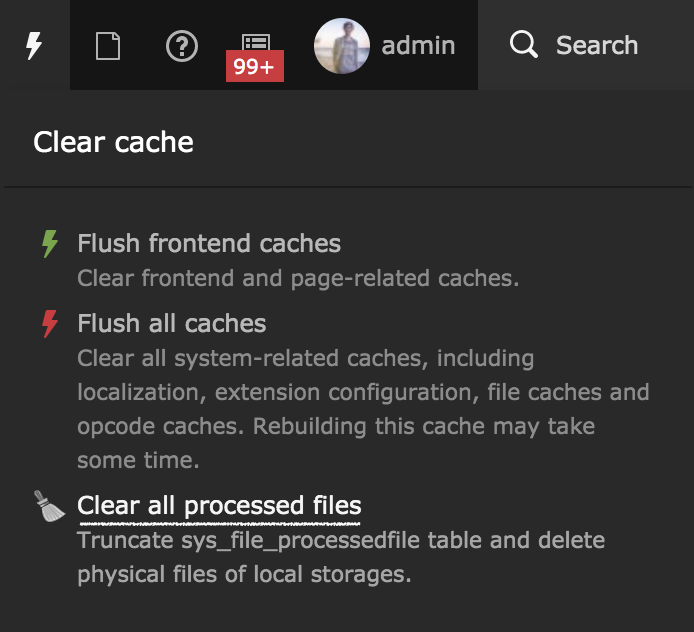

# josefglatz/toolbar-clear-processedfiles (TYPO3 Extension `toolbar_clear_processedfiles`)

> Adds a TYPO3 backend toolbar button to clear processed files on local
> storages

## Installation

### Installation using Composer

The recommended way to install the extension is by using
[Composer](https://getcomposer.org/). In your Composer based TYPO3
project root, just do `composer require
josefglatz/toolbar-clear-processedfiles`.

## Configuration

The extension is working per default if the TYPO3 backend user is an
adminstrator and

* applicationContext is `Development`,
* or applicationContext is `Production/Dev`
* or the UserTSConfig for the administrator includes
  `options.clearCache.processedfiles = 1`

---

## Use cases

* You're changing from ImageMagick to GraphicsMagick for any reason or just for testing
* You're developing cache clearing features and you need a quick way to clear processed files before doing another testrun locally
* You're just lazy and don't want to open the system tools all the time
* You're experimenting with the `GFX/jpeg_quality`. And yes it totally makes sense to play with the value even if every photographer know that value `86` is somehow a good value between big file size and quality.

**All those use cases are or at least were my use cases when working on TYPO3 projects as developer/integrator/sysadmin**

---

## Development

> The ongoing development is done within the master branch!

You can use `composer require-dev
josefglatz/toolbar-clear-processedfiles:dev-master` if you want to test
the current development state.

---

## Created by

<http://josefglatz.at/>
